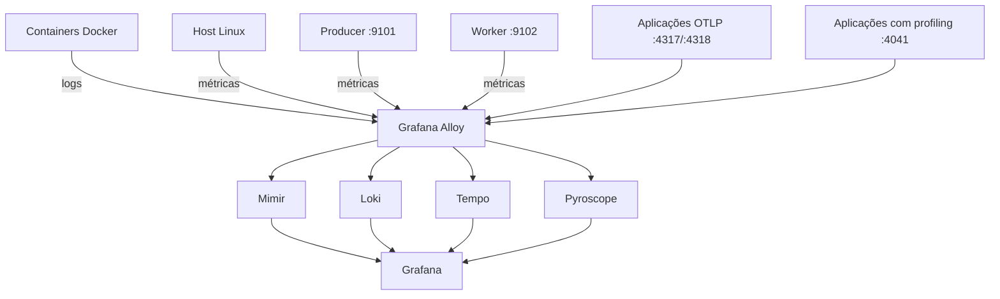

# Observability Lab

Stack de observabilidade single-node executada com Docker Compose e baseada no ecossistema Grafana. O projeto coleta e centraliza **métricas, logs, traces e profiles** sem alterar os alvos originais do laboratório.

> **Flexível por padrão:** a stack pode ser executada completa, com o Grafana incluído, ou apenas como backend de observabilidade para uma instância de Grafana já existente.

## Arquitetura



## Componentes

| Componente | Imagem | Função | Porta padrão |
|---|---|---|---:|
| Grafana | `grafana/grafana:12.3.1` | Visualização | `3000` |
| Alloy | `grafana/alloy:v1.8.1` | Coleta e roteamento | `12345`, `4317`, `4318`, `4041` |
| Loki | `grafana/loki:3.5.5` | Logs | `3100` |
| Mimir | `grafana/mimir:3.1.2` | Métricas | `9009` |
| Tempo | `grafana/tempo:2.9.0` | Traces | `3200` |
| Pyroscope | `grafana/pyroscope:1.14.1` | Profiles | `4040` |

## Alvos mantidos

A portabilidade foi adicionada sem remover ou trocar o que já era observado:

- métricas do host Linux pelo exporter Unix do Alloy;
- logs dos containers pelo Docker socket;
- label de host `olympus`;
- containers `aruba-producer`, `aruba-worker` e `aruba-mariadb` classificados como `application="argos"` e `environment="homelab"`;
- producer em `host.docker.internal:9101`;
- worker em `host.docker.internal:9102`;
- recepção OTLP nas portas `4317` e `4318`;
- recepção de profiles pelo Alloy na porta `4041`.

A stack sobe mesmo quando producer ou worker não estiverem presentes, mas esses targets aparecerão como indisponíveis.

## Pré-requisitos

- servidor Linux;
- Docker Engine;
- Docker Compose v2 (`docker compose`);
- Git;
- `make`, opcional, mas recomendado;
- acesso ao Docker socket `/var/run/docker.sock`;
- portas configuradas no `.env` livres no host.

## Instalação rápida

O repositório pode ser clonado em qualquer diretório:

```bash
git clone https://github.com/CHRIS-PIK/observability.git
cd observability
cp .env.example .env
make up
```

O comando `make up` é um alias para `make up-full` e:

1. valida Docker e Docker Compose;
2. cria o `.env` quando necessário;
3. cria as redes Docker externas;
4. cria os diretórios persistentes;
5. valida o Compose;
6. inicia toda a stack.

Sem Make:

```bash
cp .env.example .env
bash scripts/bootstrap.sh
docker compose pull
docker compose up -d
```

## Modos de deploy

### Stack completa

Use este modo quando quiser executar também o Grafana incluído no projeto:

```bash
make up
```

Ou explicitamente:

```bash
make up-full
```

Serviços iniciados:

- Grafana;
- Alloy;
- Loki;
- Mimir;
- Tempo;
- Pyroscope.

### Apenas backends

Use este modo quando já existir uma instância de Grafana no ambiente:

```bash
make up-backends
```

Serviços iniciados:

- Alloy;
- Loki;
- Mimir;
- Tempo;
- Pyroscope.

O Grafana incluído neste repositório não será iniciado. Isso não interrompe a coleta, porque o Alloy envia os dados diretamente aos respectivos backends.

Para iniciar o Grafana do projeto posteriormente:

```bash
make up-grafana
```

### Conectar um Grafana existente

Quando o Grafana estiver em outro servidor, cadastre os datasources usando o IP ou DNS do host desta stack:

| Datasource | URL |
|---|---|
| Mimir | `http://<HOST>:9009/prometheus` |
| Loki | `http://<HOST>:3100` |
| Tempo | `http://<HOST>:3200` |
| Pyroscope | `http://<HOST>:4040` |

Exemplo:

```text
http://192.168.1.50:9009/prometheus
http://192.168.1.50:3100
http://192.168.1.50:3200
http://192.168.1.50:4040
```

Quando o Grafana estiver em um container no mesmo servidor, conecte-o à rede configurada em `MONITORING_NETWORK`:

```bash
docker network connect monitoring <NOME_DO_CONTAINER_GRAFANA>
```

Nesse cenário, use os nomes internos dos serviços:

| Datasource | URL interna |
|---|---|
| Mimir | `http://mimir:9009/prometheus` |
| Loki | `http://loki:3100` |
| Tempo | `http://tempo:3200` |
| Pyroscope | `http://pyroscope:4040` |

> Garanta conectividade de rede e libere as portas necessárias no firewall quando o Grafana estiver em outro servidor. Este laboratório não configura TLS nem autenticação entre os componentes.

## Configuração

Os defaults ficam em `.env.example`. Copie o arquivo para `.env` e ajuste quando necessário:

```dotenv
DATA_ROOT=./data
FRONTEND_NETWORK=frontend
MONITORING_NETWORK=monitoring
GF_SECURITY_ADMIN_USER=admin
GF_SECURITY_ADMIN_PASSWORD=admin
```

Também é possível alterar todas as portas publicadas sem editar o Compose.

> Troque a senha do Grafana antes de expor o ambiente externamente.

## Comandos úteis

```bash
make bootstrap    # prepara redes, diretórios e .env
make validate     # valida Compose e shell
make pull         # atualiza imagens
make up           # alias para a stack completa
make up-full      # inicia Grafana e todos os backends
make up-backends  # inicia somente Alloy, Loki, Mimir, Tempo e Pyroscope
make up-grafana   # inicia somente o Grafana do projeto
make down         # encerra a stack preservando dados
make restart      # reinicia os serviços
make ps           # exibe o estado dos containers
make logs         # acompanha os logs
make clean        # remove containers órfãos
make reset        # remove a stack e todos os dados locais
```

## Acessos padrão

| Serviço | Endereço |
|---|---|
| Grafana | `http://localhost:3000` |
| Alloy UI | `http://localhost:12345` |
| Loki | `http://localhost:3100/ready` |
| Mimir | `http://localhost:9009/ready` |
| Tempo | `http://localhost:3200/ready` |
| Pyroscope | `http://localhost:4040` |

Credenciais iniciais do Grafana: `admin / admin`, salvo alteração no `.env`.

## Provisionamento do Grafana

O Grafana inicia com os seguintes datasources:

- `Mimir-homelab`, datasource padrão;
- `Loki-homelab`;
- `Tempo-homelab`;
- `Pyroscope-homelab`.

O dashboard **Observability Lab Overview** também é provisionado automaticamente, mostrando estado dos targets e logs recentes dos containers.

## Validação pós-instalação

Confira os containers:

```bash
make ps
```

Valide a configuração efetiva:

```bash
make validate
```

No Grafana, abra **Explore** e execute:

```promql
up
```

```promql
up{job=~"datalake-producer|datalake-worker"}
```

Para validar logs:

```logql
{job="docker"}
```

```logql
{application="argos"}
```

## Persistência

Por padrão, os dados ficam em `./data`, dentro do diretório do repositório:

```text
data/
├── grafana
├── loki
├── mimir
├── tempo
└── pyroscope
```

Para armazenar em outro local, altere `DATA_ROOT` no `.env`:

```dotenv
DATA_ROOT=/opt/docker/volumes/observability
```

O `make reset` apaga o diretório configurado em `DATA_ROOT` e exige confirmação explícita.

## Estrutura

```text
.
├── .github/workflows/validate.yml
├── config
│   ├── alloy/config.alloy
│   ├── grafana
│   │   ├── dashboards/observability-overview.json
│   │   └── provisioning
│   │       ├── dashboards/dashboards.yml
│   │       └── datasources/datasources.yml
│   ├── loki/loki-config.yml
│   ├── mimir/mimir-config.yml
│   ├── pyroscope/config.yaml
│   └── tempo/tempo-config.yml
├── scripts/bootstrap.sh
├── .env.example
├── docker-compose.yml
├── Makefile
├── LICENSE
└── README.md
```

## CI

O workflow do GitHub Actions valida automaticamente:

- renderização do Docker Compose;
- sintaxe do script de bootstrap;
- JSON dos dashboards;
- arquivos YAML da stack.

## Limitações

Este é um laboratório single-node com armazenamento local. Ele não inclui alta disponibilidade, TLS entre componentes, autenticação interna, object storage externo, backup automatizado ou hardening para exposição pública.

## Licença

Distribuído sob a licença MIT. Consulte o arquivo `LICENSE`.
